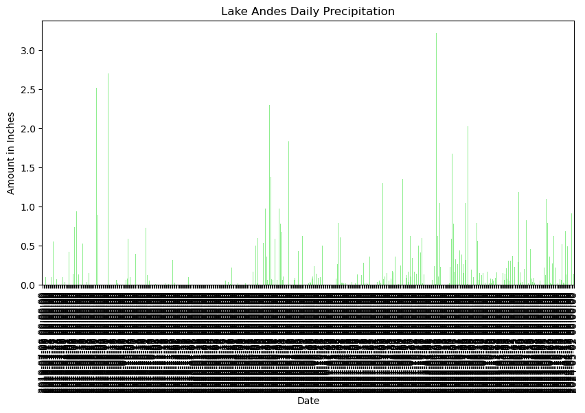

## Lake Andes Weather Analysis 
sentences


```python
# Import pandas
import pandas as pd
```


```python
# Bring in data from Lake Andes
daily_sum = ('https://www.ncei.noaa.gov/access/services/da'
'ta/v1?dataset=daily-summaries&dataTypes=TOBS,PRCP&stations'
'=US1SDCM0021&startDate=1949-10-01&endDate=2024-05-05&'
'includeStationName=true&includeStation'
'Location=1&units=standard')
daily_sum
```


    'https://www.ncei.noaa.gov/access/services/data/v1?dataset=daily-summaries&dataTypes=TOBS,PRCP&stations=US1SDCM0021&startDate=1949-10-01&endDate=2024-05-05&includeStationName=true&includeStationLocation=1&units=standard'


```python
# use pandas to download data into data frame
lakeandes_df = pd.read_csv(
  daily_sum,
  index_col='DATE',
  parse_dates=True,
  na_values=['NaN'])

lakeandes_df
```


<div>
<style scoped>
    .dataframe tbody tr th:only-of-type {
        vertical-align: middle;
    }

    .dataframe tbody tr th {
        vertical-align: top;
    }

    .dataframe thead th {
        text-align: right;
    }
</style>
<table border="1" class="dataframe">
  <thead>
    <tr style="text-align: right;">
      <th></th>
      <th>STATION</th>
      <th>NAME</th>
      <th>LATITUDE</th>
      <th>LONGITUDE</th>
      <th>ELEVATION</th>
      <th>PRCP</th>
      <th>TOBS</th>
    </tr>
    <tr>
      <th>DATE</th>
      <th></th>
      <th></th>
      <th></th>
      <th></th>
      <th></th>
      <th></th>
      <th></th>
    </tr>
  </thead>
  <tbody>
    <tr>
      <th>2019-07-06</th>
      <td>US1SDCM0021</td>
      <td>LAKE ANDES 2.4 N, SD US</td>
      <td>43.1903</td>
      <td>-98.5444</td>
      <td>502.0</td>
      <td>0.00</td>
      <td>NaN</td>
    </tr>
    <tr>
      <th>2019-07-07</th>
      <td>US1SDCM0021</td>
      <td>LAKE ANDES 2.4 N, SD US</td>
      <td>43.1903</td>
      <td>-98.5444</td>
      <td>502.0</td>
      <td>0.00</td>
      <td>NaN</td>
    </tr>
    <tr>
      <th>2019-07-08</th>
      <td>US1SDCM0021</td>
      <td>LAKE ANDES 2.4 N, SD US</td>
      <td>43.1903</td>
      <td>-98.5444</td>
      <td>502.0</td>
      <td>0.00</td>
      <td>NaN</td>
    </tr>
    <tr>
      <th>2019-07-09</th>
      <td>US1SDCM0021</td>
      <td>LAKE ANDES 2.4 N, SD US</td>
      <td>43.1903</td>
      <td>-98.5444</td>
      <td>502.0</td>
      <td>0.10</td>
      <td>NaN</td>
    </tr>
    <tr>
      <th>2019-07-10</th>
      <td>US1SDCM0021</td>
      <td>LAKE ANDES 2.4 N, SD US</td>
      <td>43.1903</td>
      <td>-98.5444</td>
      <td>502.0</td>
      <td>0.00</td>
      <td>NaN</td>
    </tr>
    <tr>
      <th>...</th>
      <td>...</td>
      <td>...</td>
      <td>...</td>
      <td>...</td>
      <td>...</td>
      <td>...</td>
      <td>...</td>
    </tr>
    <tr>
      <th>2024-04-27</th>
      <td>US1SDCM0021</td>
      <td>LAKE ANDES 2.4 N, SD US</td>
      <td>43.1903</td>
      <td>-98.5444</td>
      <td>502.0</td>
      <td>NaN</td>
      <td>NaN</td>
    </tr>
    <tr>
      <th>2024-04-28</th>
      <td>US1SDCM0021</td>
      <td>LAKE ANDES 2.4 N, SD US</td>
      <td>43.1903</td>
      <td>-98.5444</td>
      <td>502.0</td>
      <td>0.25</td>
      <td>NaN</td>
    </tr>
    <tr>
      <th>2024-04-29</th>
      <td>US1SDCM0021</td>
      <td>LAKE ANDES 2.4 N, SD US</td>
      <td>43.1903</td>
      <td>-98.5444</td>
      <td>502.0</td>
      <td>0.91</td>
      <td>NaN</td>
    </tr>
    <tr>
      <th>2024-05-01</th>
      <td>US1SDCM0021</td>
      <td>LAKE ANDES 2.4 N, SD US</td>
      <td>43.1903</td>
      <td>-98.5444</td>
      <td>502.0</td>
      <td>0.02</td>
      <td>NaN</td>
    </tr>
    <tr>
      <th>2024-05-02</th>
      <td>US1SDCM0021</td>
      <td>LAKE ANDES 2.4 N, SD US</td>
      <td>43.1903</td>
      <td>-98.5444</td>
      <td>502.0</td>
      <td>0.14</td>
      <td>NaN</td>
    </tr>
  </tbody>
</table>
<p>504 rows × 7 columns</p>
</div>


```python
# Plot the data using .plot
lakeandes_df.plot(
    y='PRCP',
    kind='bar',
    title='Lake Andes Daily Precipitation',
    xlabel='Date',
    ylabel='Amount in Inches',
    legend=False,
    color='lightgreen',
    figsize=(10,5))
lakeandes_df
```


<div>
<style scoped>
    .dataframe tbody tr th:only-of-type {
        vertical-align: middle;
    }

    .dataframe tbody tr th {
        vertical-align: top;
    }

    .dataframe thead th {
        text-align: right;
    }
</style>
<table border="1" class="dataframe">
  <thead>
    <tr style="text-align: right;">
      <th></th>
      <th>STATION</th>
      <th>NAME</th>
      <th>LATITUDE</th>
      <th>LONGITUDE</th>
      <th>ELEVATION</th>
      <th>PRCP</th>
      <th>TOBS</th>
    </tr>
    <tr>
      <th>DATE</th>
      <th></th>
      <th></th>
      <th></th>
      <th></th>
      <th></th>
      <th></th>
      <th></th>
    </tr>
  </thead>
  <tbody>
    <tr>
      <th>2019-07-06</th>
      <td>US1SDCM0021</td>
      <td>LAKE ANDES 2.4 N, SD US</td>
      <td>43.1903</td>
      <td>-98.5444</td>
      <td>502.0</td>
      <td>0.00</td>
      <td>NaN</td>
    </tr>
    <tr>
      <th>2019-07-07</th>
      <td>US1SDCM0021</td>
      <td>LAKE ANDES 2.4 N, SD US</td>
      <td>43.1903</td>
      <td>-98.5444</td>
      <td>502.0</td>
      <td>0.00</td>
      <td>NaN</td>
    </tr>
    <tr>
      <th>2019-07-08</th>
      <td>US1SDCM0021</td>
      <td>LAKE ANDES 2.4 N, SD US</td>
      <td>43.1903</td>
      <td>-98.5444</td>
      <td>502.0</td>
      <td>0.00</td>
      <td>NaN</td>
    </tr>
    <tr>
      <th>2019-07-09</th>
      <td>US1SDCM0021</td>
      <td>LAKE ANDES 2.4 N, SD US</td>
      <td>43.1903</td>
      <td>-98.5444</td>
      <td>502.0</td>
      <td>0.10</td>
      <td>NaN</td>
    </tr>
    <tr>
      <th>2019-07-10</th>
      <td>US1SDCM0021</td>
      <td>LAKE ANDES 2.4 N, SD US</td>
      <td>43.1903</td>
      <td>-98.5444</td>
      <td>502.0</td>
      <td>0.00</td>
      <td>NaN</td>
    </tr>
    <tr>
      <th>...</th>
      <td>...</td>
      <td>...</td>
      <td>...</td>
      <td>...</td>
      <td>...</td>
      <td>...</td>
      <td>...</td>
    </tr>
    <tr>
      <th>2024-04-27</th>
      <td>US1SDCM0021</td>
      <td>LAKE ANDES 2.4 N, SD US</td>
      <td>43.1903</td>
      <td>-98.5444</td>
      <td>502.0</td>
      <td>NaN</td>
      <td>NaN</td>
    </tr>
    <tr>
      <th>2024-04-28</th>
      <td>US1SDCM0021</td>
      <td>LAKE ANDES 2.4 N, SD US</td>
      <td>43.1903</td>
      <td>-98.5444</td>
      <td>502.0</td>
      <td>0.25</td>
      <td>NaN</td>
    </tr>
    <tr>
      <th>2024-04-29</th>
      <td>US1SDCM0021</td>
      <td>LAKE ANDES 2.4 N, SD US</td>
      <td>43.1903</td>
      <td>-98.5444</td>
      <td>502.0</td>
      <td>0.91</td>
      <td>NaN</td>
    </tr>
    <tr>
      <th>2024-05-01</th>
      <td>US1SDCM0021</td>
      <td>LAKE ANDES 2.4 N, SD US</td>
      <td>43.1903</td>
      <td>-98.5444</td>
      <td>502.0</td>
      <td>0.02</td>
      <td>NaN</td>
    </tr>
    <tr>
      <th>2024-05-02</th>
      <td>US1SDCM0021</td>
      <td>LAKE ANDES 2.4 N, SD US</td>
      <td>43.1903</td>
      <td>-98.5444</td>
      <td>502.0</td>
      <td>0.14</td>
      <td>NaN</td>
    </tr>
  </tbody>
</table>
<p>504 rows × 7 columns</p>
</div>


    

    

